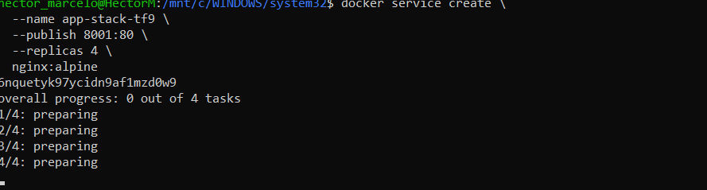
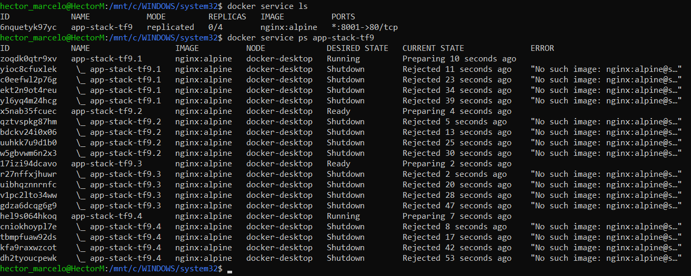

# Tarefa Final - Aula 8 - Docker Swarm

## Questão 1: Conceito de Cluster (Teórica)
**Resposta:** [Docker Compose = gerenciamento local e centralizado; Docker Swarm = orquestração distribuída em cluster.]

## Questão 2: Funções dos Nós (Teórica)
**Resposta:** [controle e inteligência do cluster; Worker = execução de tarefas]

## Questão 3: Inicialização do Swarm (Prática)
a) Comando: ``
b) Driver de Rede: **o**

## Questão 4: Criação de Service (Prática)
a) Comando:docker service ls
docker service ps app-stack-tf9

```bash
docker service create --name web-escalavel --replicas 3 nginx:alpine