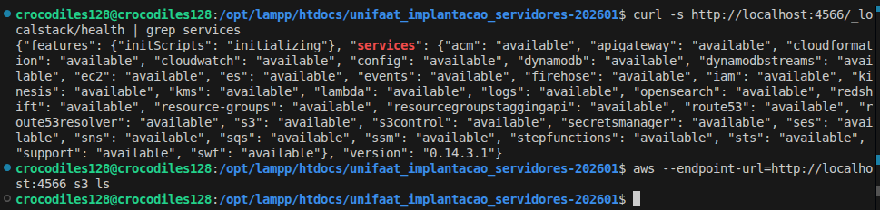
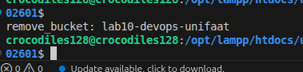

# TF010 - Conceitos de Infraestrutura em Nuvem e AWS

**RA:** 6325123  
**Aula:** 10 - Conceitos de Infraestrutura em Nuvem e AWS

## Questao 1: Modelos de Servico em Nuvem

### a) EC2 representa qual modelo?

O Amazon EC2 representa o modelo **IaaS (Infrastructure as a Service)**, pois a AWS fornece a infraestrutura virtualizada, como servidores, rede, armazenamento e virtualizacao.

Nesse modelo, o usuario ainda e responsavel por gerenciar o sistema operacional, atualizacoes, pacotes, configuracoes de seguranca, aplicacoes e dados. A AWS gerencia a infraestrutura fisica por baixo.

### b) Exemplo de SaaS ou PaaS na AWS

Um exemplo de **PaaS** na AWS e o **AWS Elastic Beanstalk**, pois ele permite publicar uma aplicacao sem gerenciar diretamente servidores, balanceadores e parte da infraestrutura.

Outro exemplo de servico gerenciado que se aproxima de PaaS e o **AWS Lambda**, onde o usuario envia o codigo e a AWS gerencia a execucao, escalabilidade e infraestrutura.

## Questao 2: Identidade e Acesso (IAM)

### a) Diferenca entre Usuario IAM e Grupo IAM

Um **Usuario IAM** representa uma identidade individual dentro da AWS, com credenciais proprias para acessar recursos.

Um **Grupo IAM** e uma colecao de usuarios. Ele facilita a administracao de permissoes, pois uma policy pode ser aplicada ao grupo e todos os usuarios dentro dele recebem essas permissoes.

### b) Por que usar Role IAM em vez de chaves root ou administrador?

E uma boa pratica usar **Role IAM** porque a instancia EC2 pode assumir permissoes temporarias sem armazenar chaves de acesso fixas dentro do servidor.

Usar chaves do usuario root ou administrador aumenta muito o risco de seguranca, pois essas credenciais normalmente possuem permissoes amplas. Com uma Role IAM, aplicamos o principio do menor privilegio, dando para a instancia apenas as permissoes necessarias, por exemplo acesso especifico ao S3.

## Questao 3: Rede Virtual na AWS (VPC)

### a) Conceito de Subnet e diferenca entre publica e privada

Uma **Subnet** e uma divisao de rede dentro de uma VPC. Ela separa a rede em blocos menores de enderecos IP e normalmente fica associada a uma Availability Zone.

Uma **Subnet Publica** possui rota para um **Internet Gateway**, permitindo comunicacao direta com a internet quando a instancia tambem possui IP publico.

Uma **Subnet Privada** nao possui rota direta para a internet. Ela e usada para recursos internos, como bancos de dados e aplicacoes que nao devem ser acessadas publicamente.

### b) Componentes de rede

Para uma instancia EC2 em uma Subnet Publica acessar a internet, e necessario um **Internet Gateway** associado a VPC e uma rota na tabela de rotas apontando para ele.

O componente usado para inspecionar e controlar trafego em nivel de subnet e a **Network ACL (NACL)**. Tambem existem os **Security Groups**, mas eles atuam no nivel da instancia.

## Questao 4: Instancias EC2

### a) Imagem do sistema operacional

O termo usado pela AWS para a imagem de sistema operacional pre-configurado e **AMI (Amazon Machine Image)**.

### b) Comando SSH pelo WSL

Comando para conectar na instancia Linux usando a chave `minha_chave.pem`:

```bash
chmod 400 minha_chave.pem
ssh -i minha_chave.pem ec2-user@54.123.45.67
```

## Questao 5: Comandos AWS CLI

### 1. Configurar credenciais

```bash
aws configure
```

### 2. Listar instancias EC2

```bash
aws ec2 describe-instances
```

### 3. Criar bucket S3 chamado meu-bucket-tf10 na regiao sa-east-1

```bash
aws s3api create-bucket \
  --bucket meu-bucket-tf10 \
  --region sa-east-1 \
  --create-bucket-configuration LocationConstraint=sa-east-1
```

Tambem poderia ser usado:

```bash
aws s3 mb s3://meu-bucket-tf10 --region sa-east-1
```

### 4. Descrever VPCs

```bash
aws ec2 describe-vpcs
```

## Questao 6: Evidencias Praticas

As evidencias foram realizadas usando **AWS CLI com LocalStack via Docker**, adicionando o endpoint local:

```bash
--endpoint-url=http://localhost:4566
```

### Parte 1: Evidencias de Configuracao

#### 1. Instalacao da AWS CLI

Comando utilizado:

```bash
aws --version
```

#### 2. Configuracao de credenciais

Comando utilizado:

```bash
aws configure list
```

As credenciais devem aparecer mascaradas na saida do terminal para evitar exposicao de informacoes sensiveis.

#### 3. LocalStack via Docker e health check

Comando usado para iniciar o LocalStack:

```bash
docker run --rm -d \
  -e SERVICES=s3,iam,ec2 \
  -e DEFAULT_REGION=sa-east-1 \
  -p 4566:4566 \
  localstack/localstack:0.14.3
```

Comando usado para verificar os servicos:

```bash
curl -s http://localhost:4566/_localstack/health | grep services
```

Evidencia:



#### 4. Teste de conectividade com LocalStack

Comando utilizado:

```bash
aws --endpoint-url=http://localhost:4566 s3 ls
```

Evidencia:


### Parte 2: Criacao de Recursos

#### 1. Criar bucket S3 com nome TF010

Comando utilizado no LocalStack:

```bash
aws --endpoint-url=http://localhost:4566 s3 mb s3://tf010-6325123
```

Comando adicional evidenciado para remocao de bucket de teste:

```bash
aws --endpoint-url=http://localhost:4566 s3 rb s3://lab10-devops-unifaat
```

Evidencia:



#### 2. Criar instancia EC2 com tag TF010

Comando utilizado no LocalStack:

```bash
aws --endpoint-url=http://localhost:4566 ec2 run-instances \
  --image-id ami-0c55b159cbfafe1f0 \
  --count 1 \
  --instance-type t2.micro \
  --tag-specifications 'ResourceType=instance,Tags=[{Key=Name,Value=TF010-6325123}]'
```

Comando para descrever a instancia criada:

```bash
aws --endpoint-url=http://localhost:4566 ec2 describe-instances
```

Evidencia em arquivo de saida:

```text
Arquivo: saida
InstanceId: i-97b93635e7343cc0e
ImageId: ami-0c55b159cbfafe1f0
InstanceType: t2.micro
State: pending
Tag Name: lab10-localstack-instance
Region/AZ: sa-east-1a
```

## Observacoes

O LocalStack foi usado para simular os servicos AWS localmente, evitando custos em uma conta real da AWS. Para todos os comandos locais, foi necessario informar o endpoint `http://localhost:4566`.

Em uma conta AWS real, os mesmos comandos seriam executados sem o parametro `--endpoint-url`, desde que as credenciais estivessem configuradas corretamente com `aws configure`.
